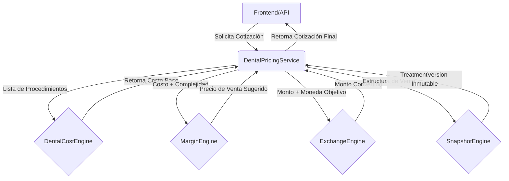

# CFE Dental — Arquitectura de la Vertical de Odontología Financiera

## 1. Visión General
CFE Dental es un módulo independiente del ecosistema Vytalix, enfocado estrictamente en la gestión financiera odontológica: costeo de tratamientos, cálculo de márgenes y rentabilidad real, simulación de cuotas, y gestión multi-divisa.

La decisión arquitectónica principal es el **aislamiento estricto** respecto al Core Clínico de Vytalix y de los algoritmos de Disglobal.

## 2. Principios Arquitectónicos

- **Ausencia de Persistencia (Temporal):** En esta fase inicial, todos los motores son "puros". Toman entradas, computan resultados financieros y devuelven estructuras de datos predecibles. La persistencia (repositorios, bases de datos) queda postergada a la Fase 3.
- **Desacoplamiento Clínico:** El catálogo de tratamientos define métricas comerciales (tiempo, costo, complejidad) y no reglas clínicas.
- **Inmutabilidad y Versionado:** Cualquier alteración a un plan de tratamiento genera un nuevo `TreatmentVersion` sin sobrescribir el historial.

## 3. Topología de Motores

El sistema se compone de cuatro motores matemáticos puros, orquestados por un servicio unificador (`DentalPricingService`).

### 3.1 DentalCostEngine (`dental-cost.engine.ts`)
Calcula el **Costo Base Real**.
Toma en cuenta el costo de materiales, costo del trabajo de laboratorio, costo por hora-silla (labor), ajuste por ubicación geográfica (CDMX vs. Monterrey), y un porcentaje de costos fijos (overhead).

### 3.2 MarginEngine (`margin.engine.ts`)
Calcula el **Margen de Ganancia y Riesgo Financiero**.
Toma el resultado del CostEngine y añade un margen de rentabilidad sugerido. Puede recibir un objetivo de ganancia manual, o calcularlo dinámicamente en base a la complejidad del tratamiento.

### 3.3 ExchangeEngine (`exchange.engine.ts`)
Gestiona el **Riesgo Cambiario**.
Realiza conversiones de moneda usando tasas de cambio o emitiendo `ExchangeRateSnapshot` para garantizar que la clínica "congele" la tasa durante el periodo de vigencia del presupuesto.

### 3.4 SnapshotEngine (`snapshot.engine.ts`)
Gestiona la **Trazabilidad y el Historial**.
Garantiza que cualquier cotización (`FinancialSnapshot`) esté vinculada a una versión inmutable (`TreatmentVersion`) del plan maestro (`TreatmentPlan`).

## 4. Flujo de Datos

## 5. Reglas de Dependencias
- `src/dental/` **PUEDE** importar de `src/shared/`.
- `src/dental/` **NO PUEDE** importar de `src/core/`, `src/longevity/`, `src/preventive/`, `src/biological-age/`, ni `src/referral/`.
